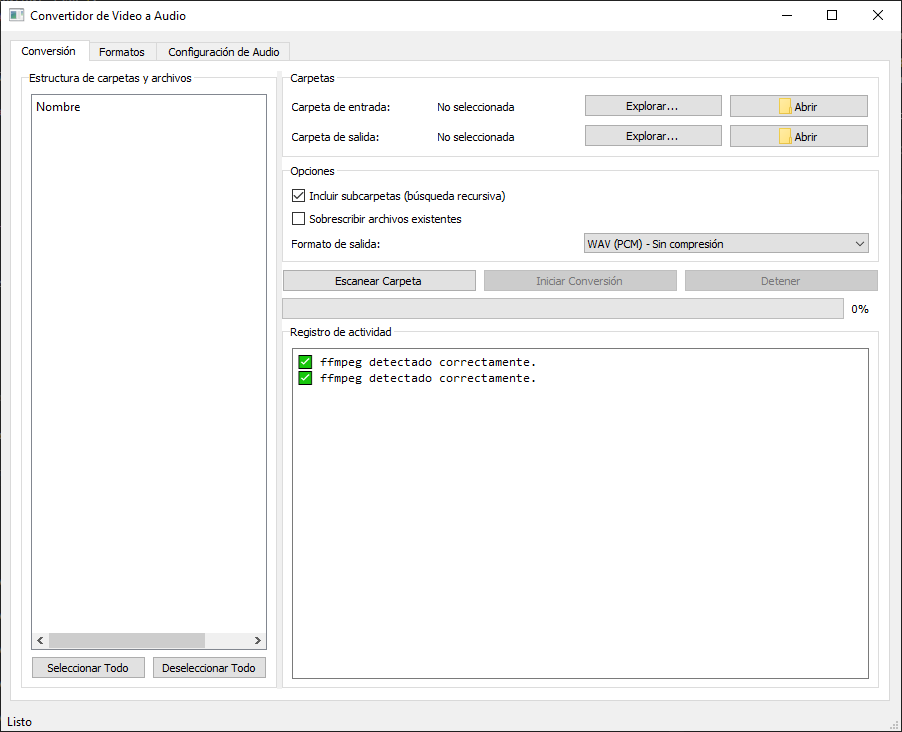

# VidToWav

Aplicación para convertir archivos de video a varios formatos de audio usando FFmpeg.



## Características

- **Interfaz gráfica moderna** con Qt5 que permite una operación intuitiva
- **Conversión a múltiples formatos de audio**:
  - WAV (PCM, calidad CD)
  - WAV para transcripción de voz (optimizado para IA)
  - MP3
  - OGG Vorbis
  - FLAC
  - AAC
  - M4A
  - Opus
  - WMA
- **Control de calidad** para formatos comprimidos
- **Explorador de archivos** con soporte para selección de carpetas y archivos individuales
- **Soporte para múltiples formatos de video** (más de 30 formatos)
- **Conversión recursiva** de subcarpetas
- **Preservación de estructura** de carpetas en los archivos de salida
- **Interfaz con pestañas** para una organización clara de las opciones
- **Multithreading** para mantener la interfaz responsiva durante la conversión
- **Registro detallado** del proceso de conversión

## Requisitos

- Python 3.6+
- PyQt5
- FFmpeg (accesible desde el PATH)

## Instalación

1. Clona o descarga este repositorio:
```
git clone https://github.com/Sn0wfly/VideoToWav.git
```

2. Instala las dependencias:
```
pip install PyQt5
```

3. Asegúrate de tener FFmpeg instalado y en el PATH:
   - **Windows**: [Descarga FFmpeg](https://ffmpeg.org/download.html) y añade la carpeta bin al PATH
   - **Mac**: `brew install ffmpeg`
   - **Linux**: `sudo apt install ffmpeg` o equivalente en tu distribución

## Uso

Ejecuta el programa con:
```
python vidtowav.py
```

### Pasos básicos:

1. Selecciona una carpeta de entrada que contenga videos
2. Elige el formato de audio de salida deseado
3. Ajusta opciones como calidad, recursividad, etc.
4. Selecciona los archivos o carpetas específicos que quieres convertir
5. Haz clic en "Iniciar Conversión"

## Estructura de carpetas

- `vidtowav.py` - Aplicación principal
- `screenshots/` - Capturas de pantalla del programa

## Licencia

Este proyecto está bajo la Licencia MIT - ver el archivo [LICENSE](LICENSE) para más detalles.

## Agradecimientos

- [FFmpeg](https://ffmpeg.org/) - El potente framework multimedia utilizado para las conversiones
- [PyQt5](https://www.riverbankcomputing.com/software/pyqt/) - Framework GUI 